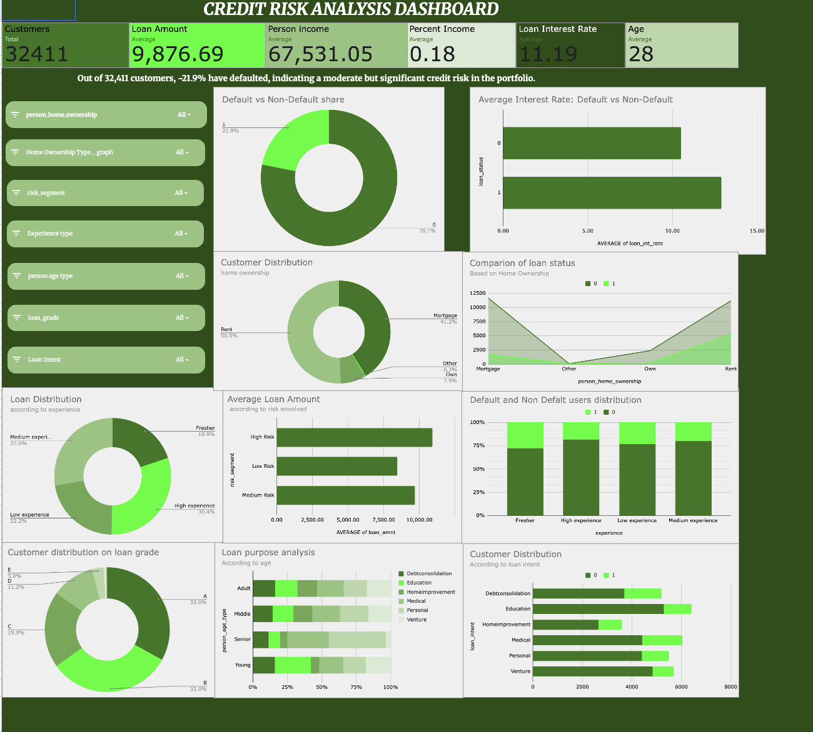

# Credit Risk Analysis and Loan Default Pattern Identification

## 📌 Project Overview
This project focuses on analyzing consumer loan data to identify key drivers of loan default and assess credit risk patterns. Using structured exploratory data analysis (EDA), KPI-driven evaluation, and interactive dashboards, the study provides actionable insights to support data-driven lending decisions and portfolio risk management.

The analysis examines borrower demographics, income stress, credit history, housing status, loan characteristics, and prior default behavior to understand how these factors influence repayment outcomes.

---

## 🖼️ Dashboard Preview

---

## 🏦 Sector
**Financial Analytics / Credit Risk Modeling**

---

## 🎓 Institute
**Newton School of Technology**

---

## 👥 Team Members
- **Shourya** – Project Lead  
- **Animesh** – Analysis Lead  
- **Punit** – Dashboard Lead  
- **Rachit** – Data & Quality Lead  
- **Prakhar** – Strategy & PPT Lead  
- **Dev** – Contributor  

---

## 🎯 Problem Statement
Despite existing borrower screening and grading systems, loan defaults persist due to overlapping and compounded risk factors that are often not analyzed holistically.

**Core Question:**  
How can borrower demographic, financial, and credit attributes be systematically analyzed to identify high-risk profiles and reduce default exposure?

---

## 📊 Dataset Description
- **Source:** Kaggle – Credit Risk Dataset  
- **Total Records:** 32,584  
- **Target Variable:**  
  - `loan_status`  
    - `1` → Default  
    - `0` → Non-Default  

### Key Feature Groups
- **Demographic:** Age, Employment Length  
- **Financial:** Income, Loan Amount, Loan-to-Income Ratio  
- **Loan Characteristics:** Loan Intent, Loan Grade, Interest Rate  
- **Credit History:** Credit History Length, Previous Default Indicator  
- **Housing:** Home Ownership Status  

---

## 🧹 Data Cleaning & Preparation
Key preprocessing steps included:
- Removal of missing critical values (interest rate)
- Handling invalid spreadsheet errors (`#DIV/0!`)
- Outlier removal for age, income, and employment length
- Standardization of categorical values
- Validation of loan-to-income ratios
- Conversion of data types for numerical analysis
- Duplicate record removal
- Binary standardization of the target variable

These steps ensured analytical accuracy and business validity.

---

## 📈 KPIs Used
- **Overall Default Rate:** ~21.9%
- **Average Loan Amount:** ₹9,876
- **Average Interest Rate:** 11.19%
- **Average Loan-to-Income Ratio:** 18%
- **Average Borrower Age:** 28 years

---

## 🔍 Exploratory Data Analysis Highlights
- Higher default rates among younger borrowers
- Strong positive correlation between loan-to-income ratio and default
- Defaulted loans carry higher interest rates and loan amounts
- Lower loan grades show significantly higher default incidence
- Medical and personal loans exhibit elevated risk
- Prior default history is a strong predictor of future default
- Renters show higher default rates than homeowners
- Short employment and credit history increase risk

---

## 🧠 Advanced Insights
- **Risk Segmentation:** Compounded risk factors dramatically increase default probability
- **Exposure Concentration:** High-risk borrowers receive larger average loan amounts
- **Non-Linear Risk Effects:** Multiple stress indicators amplify default likelihood beyond individual factors

---

## 📊 Dashboard Features
The interactive dashboard (built in Google Sheets) includes:
- Portfolio snapshot KPIs
- Default vs non-default distribution
- Interest rate comparison
- Risk segment vs loan amount
- Home ownership risk analysis
- Experience-based default trends
- Loan intent risk mapping

### Interactive Filters
- Loan Grade
- Home Ownership
- Experience Type
- Loan Intent

---

## ✅ Key Insights Summary
- Overall default rate is ~22%
- Loan-to-income ratio is the strongest default predictor
- Risk-based pricing aligns with default behavior
- Loan grades effectively differentiate risk
- Younger borrowers and renters default more frequently
- Prior defaults significantly increase future default risk
- Medical and personal loans carry higher risk
- Risk factors compound across borrower profiles

---

## 💡 Recommendations
1. Enforce stricter loan-to-income ratio caps  
2. Refine pricing within mid-risk loan grades  
3. Apply enhanced checks for high-risk loan intents  
4. Cap exposure for borrowers with compounded risk factors  
5. Implement multi-factor risk approval matrices  

---

## 📉 Impact Estimation
A **10% reduction in high-risk approvals** could result in:
- 3–5% reduction in default rates
- Improved portfolio stability
- Better capital efficiency

---

## ⚠️ Limitations
- No time-series repayment behavior
- No macroeconomic variables
- No transactional or behavioral data
- Cross-sectional analysis only

---

## 🚀 Future Scope
- Machine learning-based default prediction models
- Explainable AI for credit scoring
- Integration of macroeconomic indicators
- Real-time risk monitoring dashboards

---

## 🏁 Conclusion
This project demonstrates how structured analytics and dashboard-driven segmentation can uncover meaningful credit risk patterns. By identifying key default drivers and exposure concentration, the framework supports improved underwriting, refined pricing, and responsible lending practices while maintaining sustainable growth.

---

## 📌 Contribution Matrix

| Team Member | Dataset | Cleaning | Analysis | Dashboard | Report | PPT | Role |
|------------|--------|----------|---------|-----------|--------|-----|------|
| Shourya | ✓ | ✓ | ✓ | ✓ | ✓ | ✓ | Project Lead |
| Animesh | | ✓ | ✓ | | ✓ | | Analysis Lead |
| Punit | | ✓ | | ✓ | ✓ | | Dashboard Lead |
| Rachit | ✓ | | ✓ | | | ✓ | Data & Quality |
| Prakhar | ✓ | | | | ✓ | ✓ | Strategy & PPT |
| Dev | | ✓ | | | | ✓ | Contributor |

---

📅 **Date:** 18/02/2026  
📚 **Course:** Data Visualization & Analytics (Capstone)

